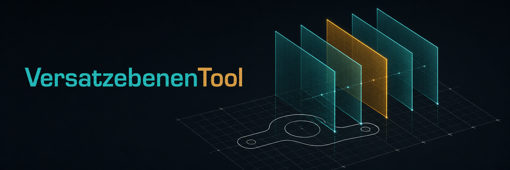
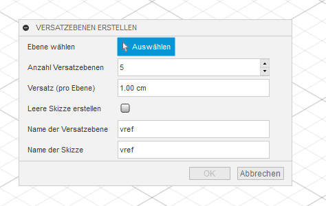
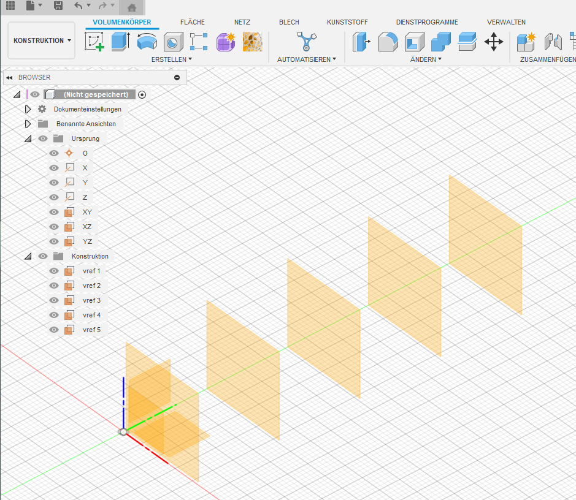
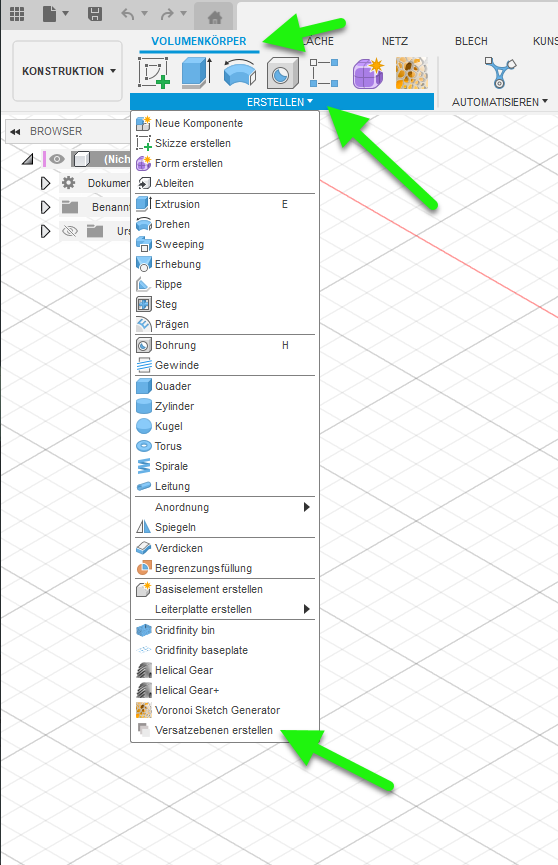

# VersatzebenenTool

<!-- version:start -->
**Current version: 1.3.0**
<!-- version:end -->

[Deutsche README](README.de.md) · [Version history](doku/version.md)

A Python add-in for Autodesk Fusion to create offset construction planes, optional sketches and timeline groups. Supports Windows and macOS; an Inno Setup installer definition is included for Windows.

## Current project status

- Create 1–50 planes in the root component from a construction plane or planar face.
- Set uniform spacing for the series. The first plane has zero offset: five planes at 1 cm spacing are placed at 0, 1, 2, 3 and 4 cm.
- Optionally create an empty sketch on every plane.
- Keep created planes visible even when sketches are created (enabled by default), or hide the new planes by disabling **Show created planes**.
- Set a minimum plane display size (default: 100 mm). Longer names receive extra width; existing larger display bounds are preserved.
- Set plane and sketch base names with automatic numbering; the default is `vref`.
- Optionally group the created objects in the timeline (requires design history).
- Display the current version in the command title.
- Use English, German, French, Spanish or Polish for the active command's labels, prompts, messages and generated group names.

Individual distances per plane are not implemented. The dialog uses document length units and validates the selection and numeric inputs. Timeline grouping is disabled in direct modeling mode. Geometry creation and native UI behavior require testing inside Fusion.

## Installation

### Windows installer

1. Open the [GitHub releases](https://github.com/know-how-schmiede/VersatzebenenTool/releases).
2. If available for the desired release, download and run `VersatzebenenTool_Setup_<Version>.exe`.
3. The installer uses `%AppData%\Autodesk\Autodesk Fusion 360\API\AddIns\VersatzebenenTool`.
4. In Fusion's **Scripts and Add-Ins** dialog, select **VersatzebenenTool** under **Add-Ins** and choose **Run**. Optionally enable **Run on Startup**.

### Manual installation (Windows and macOS)

1. Download and extract a release archive or this repository.
2. Keep the complete `fusion_addin/VersatzebenenTool` folder together. It contains `VersatzebenenTool.py` and `VersatzebenenTool.manifest`.
3. Open **Scripts and Add-Ins → Add-Ins**, use **+ / Add** and select that folder, not the repository root. Run the add-in.
4. For updates, stop the add-in, replace its files and restart it.

## Usage and language

Plane visibility is applied after sketch creation. Showing the planes also enables the root component's Construction folder, which may reveal other planes whose visibility was already enabled. The display size changes only the visual rectangle, not the plane geometry or sketch scale. For canvas labels, enable **Display Settings → Object Visibility → Construction Plane Names** in Fusion; label readability also depends on zoom and viewing angle. See [Autodesk's plane-name instructions](https://help.autodesk.com/cloudhelp/ENU/Fusion-Model/files/SLD-CONSTRUCT-PLANE-NAMES.htm).

The dialog shows the shared project banner and opens when the add-in starts with an active design. Reopen it from the **Create** panel in the Design workspace. Select a construction plane or planar face, set count and spacing, choose names and optional sketches/grouping, then confirm.

The add-in reads Fusion's language at startup using [GeneralPreferences.userLanguage](https://help.autodesk.com/cloudhelp/ENU/Fusion-360-API/files/GeneralPreferences_userLanguage.htm). Change the user language in Fusion's general preferences and restart Fusion. Unsupported languages or unavailable preferences fall back to English. User-entered names remain unchanged.

Translations are centralized in `fusion_addin/VersatzebenenTool/localization.py`. Unused sample commands under `commands/` are template code, outside the active translated UI.

## Development and version maintenance

Run `python -B -m unittest discover -s tests -v` for regression tests with Fusion API doubles. The [banner notes](doku/banner.md) document the shared asset and its generation prompt.

- `fusion_addin/VersatzebenenTool/`: installable add-in.
- `installer/VersatzebenenTool_installer.iss`: Inno Setup installer definition; compiled output goes to `dist/`.
- `doku/version.md`: release history.
- `tools/sync_version.py`: version synchronization.

For a new release, edit `VERSION` in `fusion_addin/VersatzebenenTool/version.py`, run `python tools/sync_version.py`, and add release notes to `doku/version.md`. Use `python tools/sync_version.py --check` for read-only consistency validation. Historical release entries keep their original version numbers. Compile the installer after synchronization.

License: [GPL-3.0](LICENSE).
