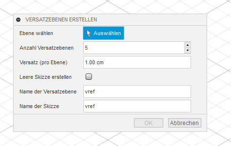
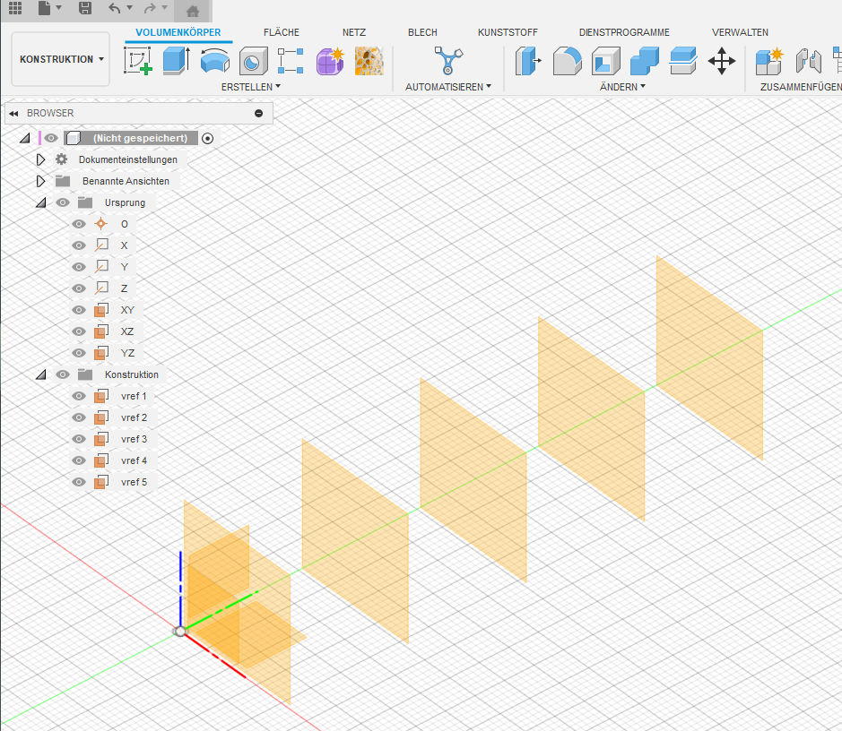
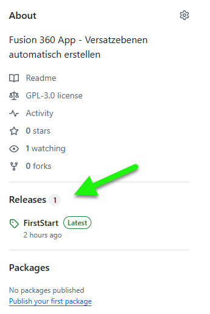
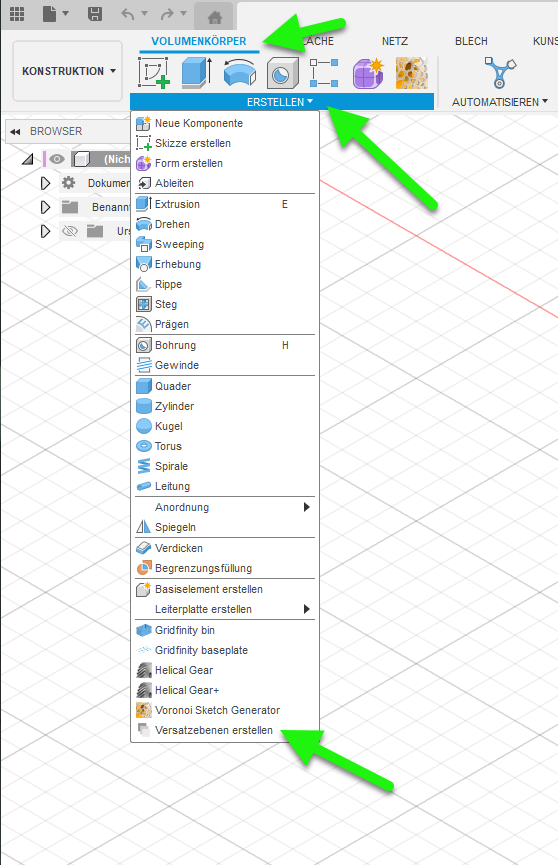

# VersatzebenenTool
Fusion 360 App - Versatzebenen automatisch erstellen

Erstelle in Sekundenschnelle eine beliebige Anzahl von Versatzebenen im Fusion 360-Design.
Unser Add-In ermöglicht dir, Abstände, Namen und sogar optionale Skizzen pro Ebene individuell festzulegen – alles in einem einfachen Dialog.
So beschleunigst du repetitive Konstruktionsaufgaben und bleibst flexibel, wenn sich Änderungen ergeben.

# Highlights:
- Frei wählbare Anzahl von Versatzebenen
- Individuelle Abstände für jeden Schritt
- Automatische Skizzenerzeugung (optional)
- Einfache Namensvergabe für Ebenen und Skizzen
- Spare Zeit und behalte die Übersicht, wenn du schnell mehrere Ebenen oder zugehörige Skizzen erzeugen möchtest!

# Installation:
## Add-In herunterladen
Lade zunächst das komplette Add-In-Paket als Release-Archiv von GitHub herunter.

## Zip-Datei entpacken
Entpacke das Archiv in einen beliebigen Ordner auf deinem Computer (z. B. „Dokumente“).

## Fusion 360 starten & Add-In-Verwaltung aufrufen
- Öffne Fusion 360.
- Wähle in der oberen Menüleiste „TOOLS“ → „Add-Ins“ (bzw. „Scripts and Add-Ins“).

## Add-In importieren
- Klicke im neu geöffneten Fenster auf den Reiter „Add-Ins“ (nicht „Scripts“).
- Klicke unten rechts auf „+“ (oder „Add“).
- Navigiere in den Ordner, den du zuvor entpackt hast, und wähle dort den Add-In-Ordner (mit manifest.json).
- Bestätige die Auswahl.

## Add-In aktivieren
- Markiere nun in der Liste dein neues Add-In.
- Klicke auf „Run“ oder „Activate“, damit Fusion 360 dein Add-In lädt.
- Optional kannst du das Häkchen bei „Run on Startup“ setzen, damit sich das Add-In beim nächsten Fusion-Start automatisch lädt.

## Einsatz des Add-Ins prüfen
- Wechsle in Fusion 360 zurück ins Design-Fenster.
- Im Erstellen-Panel unter Konstruktion erscheint nun im Menu (ganz unten) der neue Eintrag "VersatzebenenTool"
- Klick darauf, um das Add-In auszuführen

## Tipp:
- Wenn du das Add-In aktualisierst (z. B. neue Version), wiederhole Schritt 4 bzw. kopiere die aktualisierten Dateien in denselben Ordner.
- Unter Windows liegt das Standard-Add-Ins-Verzeichnis meist in
C:\\Users\\<Benutzername>\\AppData\\Roaming\\Autodesk\\Fusion 360\\API\\AddIns.
- Unter macOS findest du es unter
~/Library/Application Support/Autodesk/Autodesk Fusion 360/API/AddIns.

Viel Erfolg bei der Installation!
